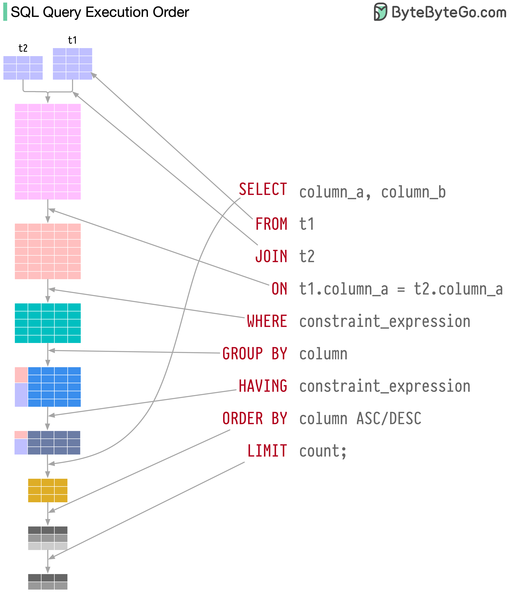

# Postgres Tutorial

> [Basic SQL](basic-sql/BasicSql.md)

> [Working with tables](working-with-tables/WorkingWithTables.md)

> [Joins](joining/Joins.md)

> [Aggregation](aggregation/Aggregation.md)

> [Sorting](sorting/Sorting.md)

> [Union, Intersection, Exclusion](union-and-intersection/UnionAndIntersection.md)