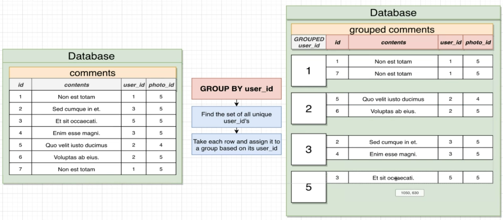
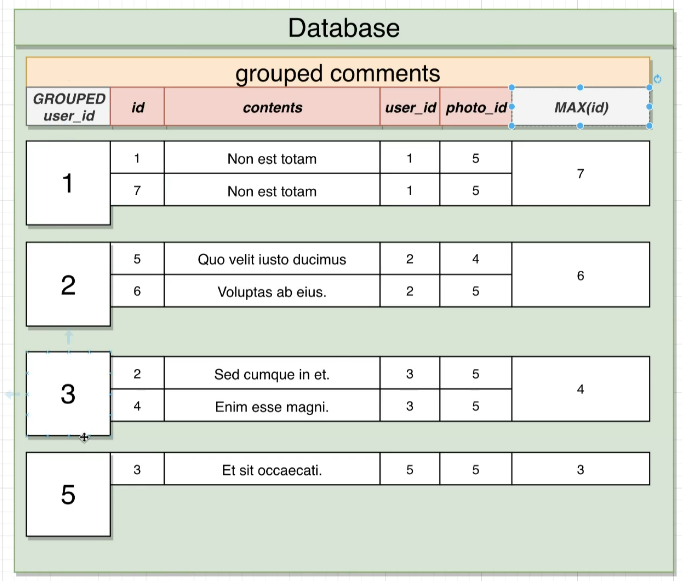

# Aggregation

Aggregation is the process of grouping data together and performing calculations on them.  
It's a very common operation in data analysis.  
It's also a very common operation in SQL.  
In fact, it's so common that SQL has a special keyword for it: `GROUP BY`.

When you hear words like 'most', 'average', 'least', then it's likely that you'll need to use aggregation.

## Grouping data

Grouping reduces many rows down to fewer rows.

To group data, you'll need to use the `GROUP BY` keyword.

```sql
SELECT user_id
  FROM photos
 GROUP
    BY user_id;
```



When selecting columns, you can only select columns that are either in the `GROUP BY` clause or in an aggregate function.

So in the above example, you can only select `user_id`.
Cannot select id, contents, user_id, photo_id.

```sql
SELECT user_id
  FROM photos
 GROUP
    BY user_id;
```

## Aggregating data

Reduces many values down to one.

Done by using an aggregate function.

```sql
SELECT user_id, COUNT(*)
  FROM photos
 GROUP
    BY user_id;
```

There are a number of aggregate functions that you can use. Some of these are:

- COUNT - returns the number of values in a group of values. 
Something to note here is that COUNT(some_column) does not consider NULL values.
To get around that, you'd use COUNT(*) instead.
- SUM - finds the sum of a group of numbers
- AVG - finds the average of a group of numbers
- MIN - finds the minimum value in a group of values
- MAX - finds the maximum value in a group of values

```sql
SELECT SUM(likes)
  FROM photos
```

## Combining grouping and aggregation

You can combine grouping and aggregation to get some meaningful data out of groups.

```sql
SELECT user_id, MAX(id)
  FROM comments
 GROUP
    BY user_id;
```



## Having

The `HAVING` keyword is used to filter groups. 
It's similar to the `WHERE` keyword, but it's used for groups instead of rows.

In the `HAVING` statement we'll usually be using aggregate functions.

In the example we're trying to find the number of comments for each photo where the photo_id is less than 3 and the photo has more than 2 comments.

```sql
SELECT photo_id, COUNT(*)
  FROM comments
 WHERE photo_id < 3
 GROUP
    BY photo_id
HAVING COUNT(*) > 2;
```

