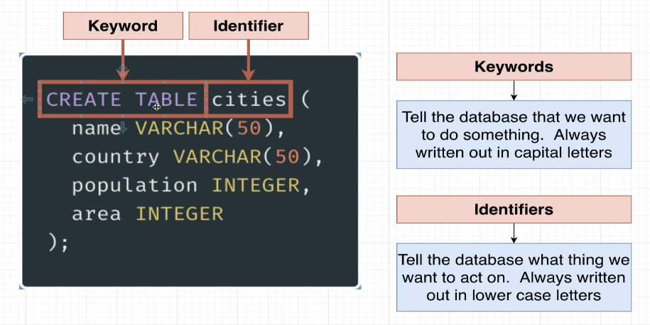
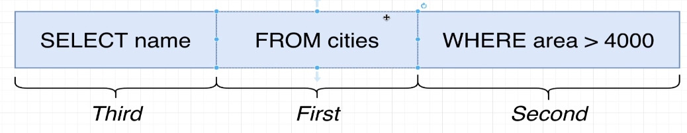

# Basic SQL
As you start using an SQL database, you'll first need a table into which to insert your data.

When writing statements in SQL, the standard requires you have to a semicolon at the end of the SQL statements.

## Creating a table
When creating a table, we specify the action `CREATE TABLE` and then an identifier `some_table`.
The identifier can be whatever you want, it's the name that you give to your table.

Within the body of the statement you then specify the columns you want your table to have.
Columns define the kind of information that each row in your database will hold.

The columns need to specify what kind of data it will contain and what constraints it might have.
When an insertion happens, then the DB validates the data against these constraints.

```sql
CREATE TABLE some_table(
    string_property VARCHAR(50),
    integer_property INTEGER
);
```



## Inserting data
When inserting into a table, then you specify the operation of `INSERT INTO` and then specify the identifier of the table you want to insert into `some_table`.

Within the body of the statement you specify the column names that you want to insert into.
Based on the order in which you define these, you'll also have to define the values later on.

If you want to insert multiple values with one insert, then you'll have to separate them by
commas.

```sql
INSERT INTO some_table(
    string_property, integer_property
) VALUES (
    'Some name', 123
), (
    'Some other name', 456
);
```

## Querying data
When querying data, you do it by using a `SELECT` operation. You can specify all the columns
when querying `SELECT * FROM some_table` or specific columns
`SELECT string_property, integer_property FROM some_table`.

```sql
SELECT string_property FROM some_table;
```

You can not only query data, but also calculate new data with the data on the server. By
default, that data is returned as a new column. You can also alias the column name with the
`AS` keyword.

```sql
SELECT country_name, population / area AS population_density FROM countries;
```

There are multiple different operators to work on strings, such as `concact`, `lower`,
`length`, `upper`. What differs in SQL, compared to other languages, when it comes to
string concatenation, is that you have to use the `||` operator, instead of the `+` operator.

```sql
SELECT name || ' ' || surname AS full_name FROM people;
```

## Filtering data
When filtering data, you can use the `WHERE` keyword. You can use the `AND` and `OR` keywords
to combine multiple filters.

```sql
SELECT * FROM some_table WHERE string_property = 'Some name' OR integer_property > 123;
```

When reading the SQL statement, then you shouldn't simply go left to right, as the order of
execution is a bit different. First runs the FROM clause, then the WHERE clause, then the
SELECT clause.



There are a bunch of comparison operators that can be used in the WHERE clause, such as
`=`, `>`, `<`, `>=`, `<=`, `<>` (not equal), `IN`, `LIKE`, and `BETWEEN`.

You can also perform calculations inside the WHERE clause and compare against that.

```sql
SELECT * 
FROM some_table 
WHERE integer_property BETWEEN 100 AND 200
   OR another_property = 123
   OR third > 123
   OR fourth < 123
   OR fifth >= 123
   OR sixth <= 123
   OR seventh <> 123
   OR eighth IN (1, 2, 3)
   OR ninth NOT IN ('banana', 'apple')
   OR tenth LIKE 'Some%'
   OR third / fourth > 123;
```

## Updating data
When updating data, you can use the `UPDATE` keyword. Remember, that you have to specify
the `WHERE` clause, otherwise you'll update all the rows in the table. And even if it's
specified, then the condition can still span multiple rows. So the `UPDATE` keyword can
run on a single row or multiple, depending on the `WHERE` condition you provide to it.

```sql
UPDATE some_table 
   SET some_property = 'Some value' 
 WHERE id = 123;
```

## Deleting data
When deleting data, you can use the `DELETE` keyword. Remember, that you have to specify
the `WHERE` clause, otherwise you'll delete all the rows in the table. And even if it's
specified, then the condition can still span multiple rows. So the `DELETE` keyword can
run on a single row or multiple, depending on the `WHERE` condition you provide to it.

```sql
DELETE 
  FROM some_table 
 WHERE id = 123;
```