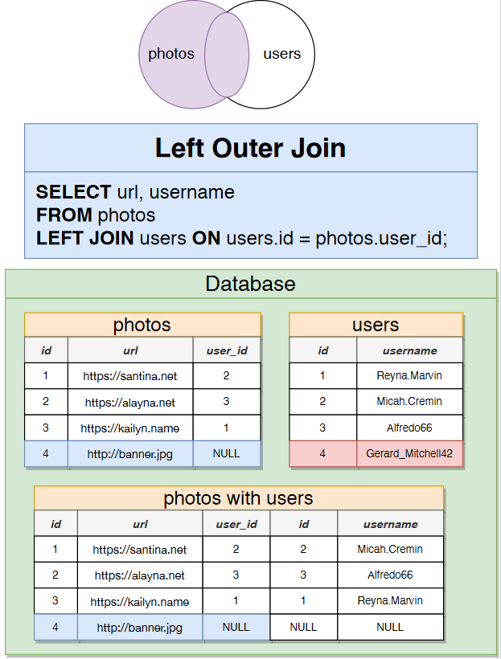

# Joins

Joins produce values from multiple tables

You'd reach for a join when you're asked to find data that involves multiple resources.

## Joining tables
In order to join tables, you'll need to use the JOIN keyword.

```sql
SELECT url, username
  FROM photos
  JOIN users 
    ON photos.user_id = users.id
 WHERE users.id = 1;
```

You can use the AS keyword to rename columns.

```sql
SELECT url, username AS author
  FROM photos
  JOIN users 
    ON photos.user_id = users.id
 WHERE users.id = 1;
```

You can also use the AS keyword to rename tables. It is also possible to omit the AS keyword.

```sql
SELECT url, username AS author
  FROM photos AS p
  JOIN users u
    ON p.user_id = u.id
 WHERE u.id = 1;
```

There are multiple different types of joins.

The default is INNER JOIN, which means that only rows that match the join condition are returned.
With the example below, if a photos row doesn't have a matching users row, then it won't be returned.
So this requires a full overlap. 

```sql
SELECT url, username AS author
  FROM photos AS p
 INNER
  JOIN users u
    ON p.user_id = u.id
 WHERE u.id = 1;
```


You can also use LEFT JOIN, which means that all rows from the left table are returned, even if there are no matching rows in the right table.
The left table is the one that is specified before the JOIN keyword.
The right table is the one that is specified after the JOIN keyword.
With the example below, if a users row doesn't have a matching photos row, then it will still be returned.

```sql
SELECT url, username AS author
  FROM photos AS p
  LEFT
  JOIN users u
    ON p.user_id = u.id
 WHERE u.id = 1;
```



You can also use RIGHT JOIN, which means that all rows from the right table are returned, even if there are no matching rows in the left table.
The left table is the one that is specified before the JOIN keyword.
The right table is the one that is specified after the JOIN keyword.
With the example below, if a photos row doesn't have a matching users row, then it will still be returned.

```sql
SELECT url, username AS author
  FROM photos AS p
  RIGHT
  JOIN users u
    ON p.user_id = u.id
 WHERE u.id = 1;
```


You can also use FULL JOIN, which means that all rows from both tables are returned, even if there are no matching rows.

```sql
SELECT url, username AS author
  FROM photos AS p
  FULL
  JOIN users u
    ON p.user_id = u.id
 WHERE u.id = 1;
```


To join more than two tables, you'll need to use multiple JOIN keywords.

```sql
SELECT url, contents, username
FROM comments
JOIN photos
  ON comments.photo_id = photos.id
JOIN users
  ON comments.user_id = users.id
 AND photos.user_id = users.id;
```
