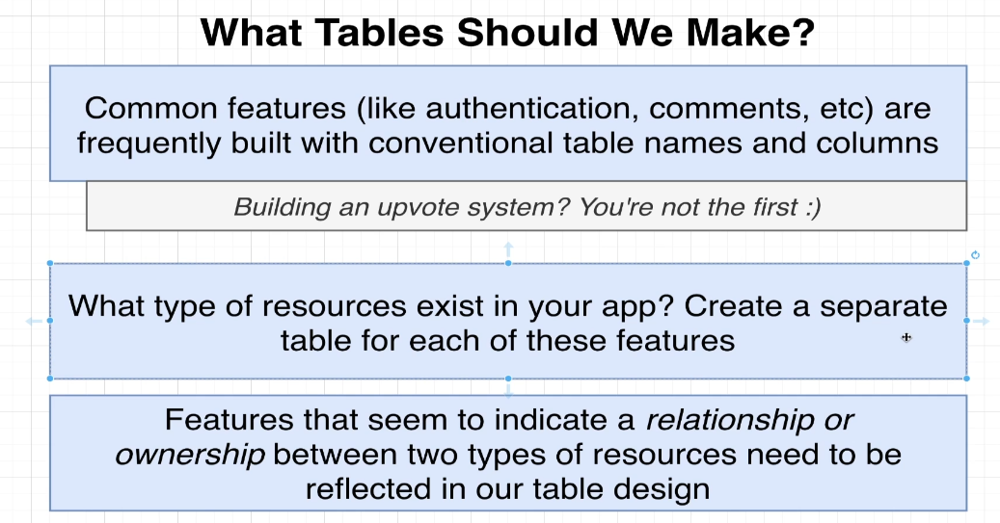
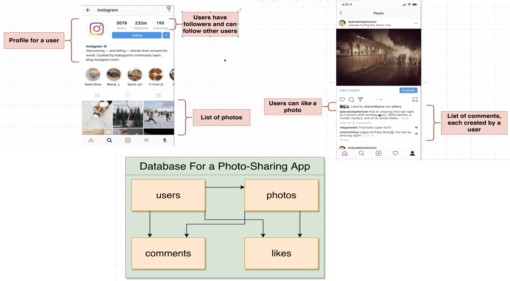
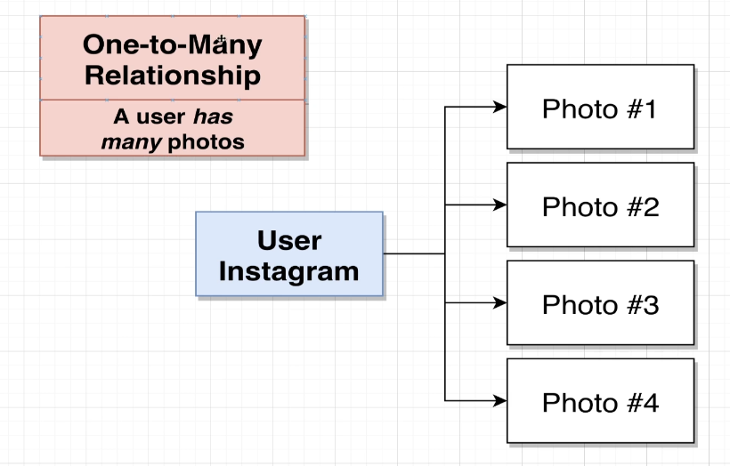
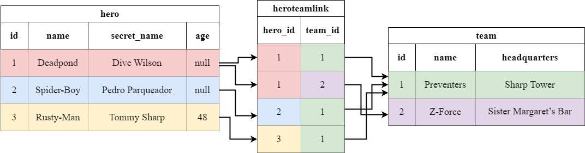
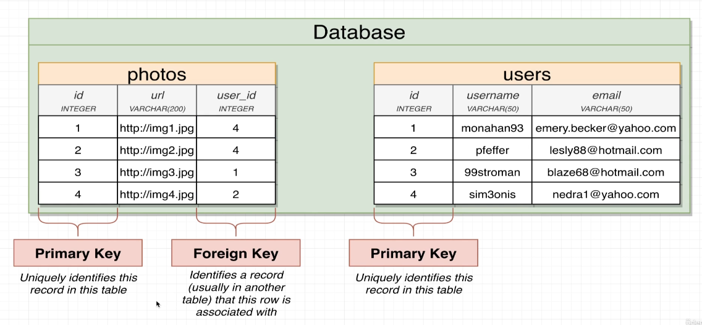

# Working with tables
When creating a table, you'll find that for a lot of the cases, you won't be the first person designing it. 
So you might want to start with a quick google search to see if there's already a table design that you can use.



You'll need some sort of analysis performed to decide what tables you might need and how they relate to one another.
One way of approaching this is to look at the UI mockup and see what kind of data you'll need to display.



## One-to-many (many-to-one) relationships
This is a type of relationship where one entity can have multiple entities related to it.

When you have a one-to-many relationship, then you'll need to have a foreign key on the many side of the relationship.
This foreign key will point to the primary key of the one side of the relationship.



You can also call this a many-to-one relationship. 
That means that you're looking at it from the perspective of the many side of the relationship.

## One-to-one relationships
This is a type of relationship where one entity can have one entity related to it.

When you have a one-to-one relationship, then you'll need to have a foreign key on both sides of the relationship.

For example, a boat can have one captain and a captain can have one boat.

## Many-to-many relationships
This is a type of relationship where multiple entities can have multiple entities related to it.

For a many-to-many relationship, you'll need to have a third table that holds the foreign keys to both sides of the relationship.

For example, a student can have multiple courses and a course can have multiple students.



## Primary keys and foreign keys
A primary key is a column that uniquely identifies a row in a table.

A foreign key is a column that points to the primary key of another table.

The foreign key is used to create a relationship between two tables.

The foreign key denotes that this row is owned by the row in the other table. 

IDs are usually either integers or UUIDs.



## Auto-incrementing primary keys
When you're creating a table, you'll often want to have a primary key that auto-increments.

This means that you don't have to specify the value of the primary key when inserting a row into the table.

The database will automatically assign a value to the primary key.

```sql
CREATE TABLE some_table(
    id SERIAL PRIMARY KEY,
    ...
);
```

The SERIAL keyword is a Postgres specific keyword.
It's a shortcut for a combination of the INTEGER and AUTO_INCREMENT keywords.
What it does is that it automatically generates a value for the column when you insert a row into the table.

The PRIMARY KEY keyword is used to specify that this column is the primary key of the table.
It's a shortcut for the UNIQUE and NOT NULL keywords. 
Additionally, it also creates an index on the column.
An index is a data structure that is used to speed up queries.

## Defining foreign keys
To define a foreign key, you'll need to use the REFERENCES keyword.

```sql
CREATE TABLE some_table(
    id SERIAL PRIMARY KEY,
    other_table_id INTEGER REFERENCES other_table(id),
    ...
);
```

If the other table has a primary key of UUID type, then you'll need to use the UUID type for the foreign key.

```sql
CREATE TABLE some_table(
    id SERIAL PRIMARY KEY,
    other_table_id UUID REFERENCES other_table(id),
    ...
);
```

## Joining tables
To join two tables, you'll need to use the JOIN keyword.

```sql
SELECT url, username
  FROM photos
  JOIN users 
    ON photos.user_id = users.id
 WHERE users.id = 1;
``` 

## Dropping tables
To drop a table, that is to delete it, you'll need to use the DROP TABLE keyword.

```sql
DROP TABLE some_table;
```

## Delete propagation
When you delete a row from a table, you'll often want to delete the rows that are related to it.

For example, if you delete a user, you'll want to delete all the photos that the user has uploaded.

This is called delete propagation.

To enable delete propagation, you'll need to use the CASCADE keyword.

```sql
CREATE TABLE photos(
    id SERIAL PRIMARY KEY,
    user_id INTEGER REFERENCES users(id) ON DELETE CASCADE,
    ...
);
```

There are multiple different options for ON DELETE.

The default is NO ACTION, which means that nothing happens. 
It'll throw an error if you try to delete a row that has a foreign key pointing to it.
This is the default option.
```sql
CREATE TABLE photos(
    id SERIAL PRIMARY KEY,
    user_id INTEGER REFERENCES users(id) ON DELETE NO ACTION,
    ...
);
```

You can also use RESTRICT, which means that the delete is not allowed. It'll throw an error if you try to delete a row that has a foreign key pointing to it.
```sql
CREATE TABLE photos(
    id SERIAL PRIMARY KEY,
    user_id INTEGER REFERENCES users(id) ON DELETE RESTRICT,
    ...
);
```

You can also use SET NULL, which means that the foreign key is set to NULL.
```sql
CREATE TABLE photos(
    id SERIAL PRIMARY KEY,
    user_id INTEGER REFERENCES users(id) ON DELETE SET NULL,
    ...
);
```

You can also use SET DEFAULT, which means that the foreign key is set to the default value.
```sql
CREATE TABLE photos(
    id SERIAL PRIMARY KEY,
    user_id INTEGER REFERENCES users(id) ON DELETE SET DEFAULT,
    ...
);
```